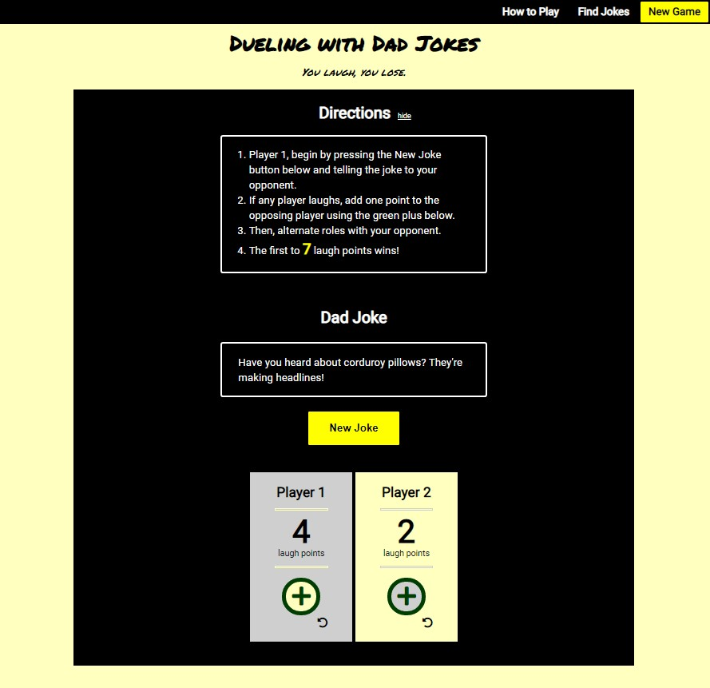
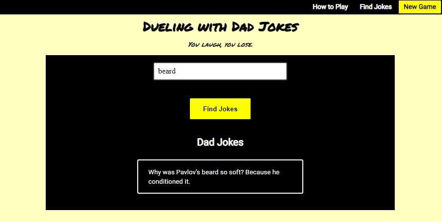

# Dueling With Dad Jokes
* [live app](https://caleb-king.github.io/dueling-with-dad-jokes/)

## Summary

Dueling with Dad Jokes is a web app which provides users a fun and lighthearted experience with friends through playing a game where they face-off by telling terrible dad jokes to each other and try not to laugh. 

More detailed instructions for how to play can be found on the [home page](https://caleb-king.github.io/dueling-with-dad-jokes/index.html) of the app. There you will also find a video example of two dads facing off.

I am using the icanhazdadjoke.com API for my joke database to provide random jokes during gameplay. I am also using this API in my Find Jokes feature.

## Screenshots

How to Play/Landing Page:

Gameplay:

Find Jokes:

## Technical Requirements

* Used fetch for AJAX calls and jQuery for DOM manipulation
* Used namespacing to adhere to good architecture practices
* Minimal global variables
* Created modules in separate files to organize my code
* Logically grouped my functions
* Used semantic HTML
* Used a responsive and mobile-first design
* Visually and functionally solid in viewports for mobile and desktop
* Followed a11y best practices
